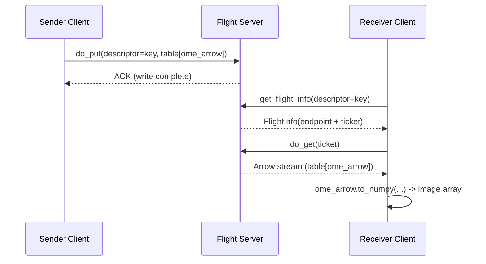
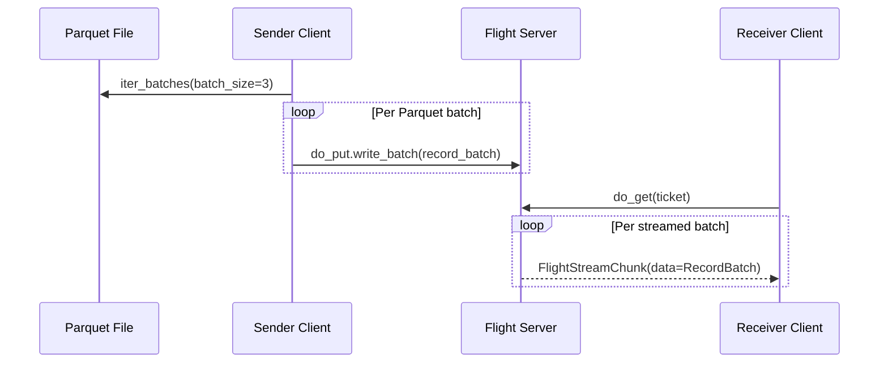

# demo-arrow-flight

A minimal, educational demo that sends an OME-Arrow image payload through an Apache Arrow Flight server and receives it back as a NumPy array.

## What this project demonstrates

- How to model an image as an `ome_arrow` struct scalar.
- How to wrap that scalar in an Arrow table (`ome_arrow` column).
- How to transfer the table over Flight (`do_put` / `do_get`).
- How to decode the received payload back into an image.

## Arrow Flight flow



## Project layout

- `src/demo_arrow_flight/ome_image.py`: deterministic demo image and OME-Arrow conversion.
- `src/demo_arrow_flight/flight_server.py`: tiny in-memory Flight server.
- `src/demo_arrow_flight/transfer.py`: client send/receive helpers.
- `src/demo_arrow_flight/cli.py`: CLI commands for server/send/receive and split roundtrips.
- `tests/`: focused tests for payload generation, transfer, and CLI.

## Requirements

- Python 3.11+
- [uv](https://docs.astral.sh/uv/)

## Quick start

Install dependencies (including dev tools):

```bash
uv sync --all-groups
```

Run the one-value roundtrip demo:

```bash
uv run demo-arrow-flight roundtrip-one
```

Expected output includes:

```text
Roundtrip one successful: location=..., key=demo-image, shape=(96, 128), checksum=...
```

## Running with poethepoet

This repo uses `poethepoet` tasks for common workflows.

List tasks:

```bash
uv run poe
```

Main tasks:

- `uv run poe install`: install all dependency groups.
- `uv run poe test`: run test suite.
- `uv run poe demo`: one-command single-value roundtrip.
- `uv run poe demo_column`: one-command multi-row OME-Arrow column roundtrip.
- `uv run poe server`: run a persistent Flight server on `127.0.0.1:8815`.
- `uv run poe send`: send demo payload to the server.
- `uv run poe receive`: fetch payload from the server and print image stats.
- `uv run poe parquet_generate`: create randomized parquet dataset with `ome_arrow` column.
- `uv run poe parquet_stream`: stream parquet dataset to Flight in record-batch chunks.
- `uv run poe parquet_receive`: receive chunk stream and print chunk sizes.
- `uv run poe parquet_demo`: one-command parquet generate + chunk stream + receive.

## Manual multi-terminal flow

Terminal 1:

```bash
uv run demo-arrow-flight server --host 127.0.0.1 --port 8815
```

Terminal 2:

```bash
uv run demo-arrow-flight send --host 127.0.0.1 --port 8815 --key demo-image
uv run demo-arrow-flight receive --host 127.0.0.1 --port 8815 --key demo-image
```

## Split roundtrip demos

Single OME-Arrow value:

```bash
uv run demo-arrow-flight roundtrip-one
```

Multi-row OME-Arrow column:

```bash
uv run demo-arrow-flight roundtrip-column \
  --rows 8 \
  --height 32 \
  --width 32 \
  --seed 19
```

Note: `roundtrip` remains as a backward-compatible alias of `roundtrip-one`.

## Independent demo: parquet dataset with randomized `ome_arrow` images

This is separate from the single-image roundtrip demo.

1. Create a parquet file with randomized image rows:

```bash
uv run demo-arrow-flight parquet-generate \
  --output /tmp/random_ome_dataset.parquet \
  --rows 10 \
  --height 64 \
  --width 64 \
  --seed 11
```

2. Start Flight server in one terminal:

```bash
uv run demo-arrow-flight server --host 127.0.0.1 --port 8815
```

3. Stream parquet rows in chunks (second terminal):

```bash
uv run demo-arrow-flight parquet-stream \
  --host 127.0.0.1 \
  --port 8815 \
  --key random-ome-dataset \
  --parquet-path /tmp/random_ome_dataset.parquet \
  --batch-rows 3
```

4. Receive and inspect chunk sizes (second terminal):

```bash
uv run demo-arrow-flight parquet-receive \
  --host 127.0.0.1 \
  --port 8815 \
  --key random-ome-dataset
```

Expected receive output includes something like:

```text
Received stream ... chunks=4, chunk_rows=[3, 3, 3, 1], total_rows=10
```

All-in-one local command:

```bash
uv run demo-arrow-flight parquet-demo \
  --output /tmp/random_ome_dataset.parquet \
  --rows 10 \
  --height 64 \
  --width 64 \
  --seed 11 \
  --batch-rows 3
```



## Testing

Run:

```bash
uv run poe test
```

Current tests cover:

- Demo image shape/type and OME-Arrow conversion correctness.
- End-to-end Flight transfer roundtrip.
- CLI `roundtrip` alias and `roundtrip-column` smoke behavior.
- Randomized parquet generation with `ome_arrow` column.
- Chunked parquet streaming over Flight and received chunk boundaries.

## Notes

- The server is intentionally in-memory for clarity.
- The demo uses a single row and a single `ome_arrow` column to keep the transport pattern explicit.
- For production, add authentication/TLS, larger dataset handling, and persistence.
