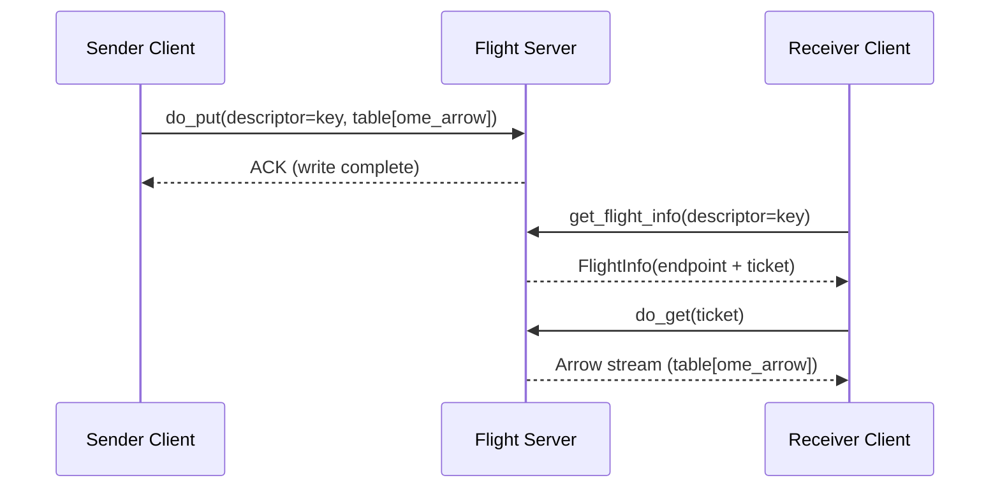
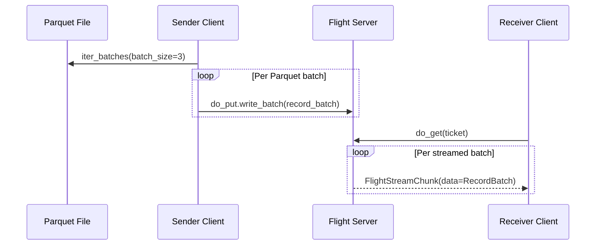
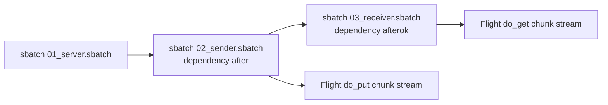

# demo-arrow-flight

A minimal, educational demo that sends OME-Arrow payloads through Apache Arrow Flight and keeps data Arrow-native by default.

## What this project demonstrates

- How to model an image as an `ome_arrow` struct scalar.
- How to wrap that scalar in an Arrow table (`ome_arrow` column).
- How to transfer the table over Flight (`do_put` / `do_get`).
- How to keep Flight transfers Arrow-native and avoid unnecessary conversion.

## Arrow Flight flow



## Project layout

- `src/demo_arrow_flight/ome_image.py`: deterministic demo image and OME-Arrow conversion.
- `src/demo_arrow_flight/flight_server.py`: tiny in-memory Flight server.
- `src/demo_arrow_flight/transfer.py`: client send/receive helpers.
- `src/demo_arrow_flight/cli.py`: CLI commands for server/send/receive, pipeline, and benchmarks.
- `src/demo_arrow_flight/flight_pipeline_demo.py`: multi-stage Flight-key pipeline helpers.
- `src/demo_arrow_flight/benchmarking.py`: baseline-vs-Flight benchmark helpers.
- `src/demo_arrow_flight/slurm_simulation.py`: local Slurm-like staged run helper.
- `examples/slurm/`: `sbatch` templates for server/sender/receiver, pipeline, and benchmarks.
- `docs/notebooks/demo_walkthrough.ipynb`: executed notebook showing high-level demos and outputs.
- `tests/`: focused tests for payload generation, transfer, and CLI.

## Requirements

- Python 3.11+
- [uv](https://docs.astral.sh/uv/)

## Quick start

Install dependencies (including dev tools):

```bash
uv sync --all-groups
```

Run the one-value roundtrip demo:

```bash
uv run demo-arrow-flight roundtrip-one
```

Expected output includes:

```text
Roundtrip one successful: location=..., key=demo-image, shape(T,C,Z,Y,X)=(1, 1, 1, 96, 128)
```

## Running with poethepoet

This repo uses `poethepoet` tasks for common workflows.

List tasks:

```bash
uv run poe
```

Main tasks:

- `uv run poe install`: install all dependency groups.
- `uv run poe test`: run test suite.
- `uv run poe demo`: one-command single-value roundtrip.
- `uv run poe demo_column`: one-command multi-row OME-Arrow column roundtrip.
- `uv run poe server`: run a persistent Flight server on `127.0.0.1:8815`.
- `uv run poe send`: send demo payload to the server.
- `uv run poe receive`: fetch payload from the server and print OME-Arrow metadata.
- `uv run poe parquet_generate`: create randomized parquet dataset with `ome_arrow` column.
- `uv run poe parquet_stream`: stream parquet dataset to Flight in record-batch chunks.
- `uv run poe parquet_receive`: receive chunk stream and print chunk sizes.
- `uv run poe parquet_demo`: one-command parquet generate + chunk stream + receive.
- `uv run poe pipeline_demo`: one-command produce -> transform -> consume Flight pipeline.
- `uv run poe benchmark_demo`: local baseline-vs-Flight benchmark and CSV output.
- `uv run poe benchmark_overhead`: direct parquet write+read vs Flight roundtrip comparison.
- `uv run poe slurm_simulate`: local Slurm-style simulation with per-job logs.

## Manual multi-terminal flow

Terminal 1:

```bash
uv run demo-arrow-flight server --host 127.0.0.1 --port 8815
```

Terminal 2:

```bash
uv run demo-arrow-flight send --host 127.0.0.1 --port 8815 --key demo-image
uv run demo-arrow-flight receive --host 127.0.0.1 --port 8815 --key demo-image
```

## Split roundtrip demos

Single OME-Arrow value:

```bash
uv run demo-arrow-flight roundtrip-one
```

Multi-row OME-Arrow column:

```bash
uv run demo-arrow-flight roundtrip-column \
  --rows 8 \
  --height 32 \
  --width 32 \
  --seed 19
```

Note: `roundtrip` remains as a backward-compatible alias of `roundtrip-one`.

## Independent demo: Flight pipeline transport (not one-shot)

This demo uses Flight keys as explicit pipeline stages:

- `pipeline-raw`: producer writes dataset
- `pipeline-processed`: transformer reads `pipeline-raw`, adds stage metadata, writes new key
- consumer reads `pipeline-processed`

All-in-one local command:

```bash
uv run demo-arrow-flight pipeline-demo \
  --rows 10 \
  --height 32 \
  --width 32 \
  --seed 17 \
  --stage-name preprocess
```

Scriptable stage-by-stage flow (for orchestration systems):

```bash
uv run demo-arrow-flight pipeline-produce --host 127.0.0.1 --port 8815 --key pipeline-raw
uv run demo-arrow-flight pipeline-transform --host 127.0.0.1 --port 8815 --input-key pipeline-raw --output-key pipeline-processed --stage-name preprocess
uv run demo-arrow-flight pipeline-consume --host 127.0.0.1 --port 8815 --key pipeline-processed
```

## Independent demo: parquet dataset with randomized `ome_arrow` images

This is separate from the single-image roundtrip demo.

1. Create a parquet file with randomized image rows:

```bash
uv run demo-arrow-flight parquet-generate \
  --output /tmp/random_ome_dataset.parquet \
  --rows 10 \
  --height 64 \
  --width 64 \
  --seed 11
```

2. Start Flight server in one terminal:

```bash
uv run demo-arrow-flight server --host 127.0.0.1 --port 8815
```

3. Stream parquet rows in chunks (second terminal):

```bash
uv run demo-arrow-flight parquet-stream \
  --host 127.0.0.1 \
  --port 8815 \
  --key random-ome-dataset \
  --parquet-path /tmp/random_ome_dataset.parquet \
  --batch-rows 3
```

4. Receive and inspect chunk sizes (second terminal):

```bash
uv run demo-arrow-flight parquet-receive \
  --host 127.0.0.1 \
  --port 8815 \
  --key random-ome-dataset
```

Expected receive output includes something like:

```text
Received stream ... chunks=4, chunk_rows=[3, 3, 3, 1], total_rows=10
```

All-in-one local command:

```bash
uv run demo-arrow-flight parquet-demo \
  --output /tmp/random_ome_dataset.parquet \
  --rows 10 \
  --height 64 \
  --width 64 \
  --seed 11 \
  --batch-rows 3
```



## Independent demo: transport benchmarks with baseline

Compare:

- Baseline: local parquet scan (`iter_batches`) without Flight transport
- Flight: `do_put` + `do_get` streamed transport
- Overhead comparison: parquet write+read vs Flight table roundtrip (same Arrow table)

All-in-one local benchmark:

```bash
uv run demo-arrow-flight benchmark-demo \
  --output /tmp/random_ome_benchmark.parquet \
  --rows 20 \
  --height 64 \
  --width 64 \
  --seed 29 \
  --batch-rows 4 \
  --repeats 3 \
  --output-csv /tmp/demo_arrow_flight_benchmark.csv
```

Use an existing server instead:

```bash
uv run demo-arrow-flight benchmark-transport \
  --host 127.0.0.1 \
  --port 8815 \
  --parquet-path /tmp/random_ome_dataset.parquet \
  --batch-rows 4 \
  --repeats 3 \
  --output-csv /tmp/demo_arrow_flight_benchmark.csv
```

CSV contains rows for both `baseline_parquet_read` and `flight_stream`.

Direct overhead benchmark command:

```bash
uv run demo-arrow-flight benchmark-overhead \
  --host 127.0.0.1 \
  --port 8815 \
  --rows 320 \
  --height 64 \
  --width 64 \
  --seed 31 \
  --repeats 3 \
  --output-csv /tmp/demo_arrow_flight_overhead.csv
```

## Independent demo: Slurm user perspective

This repo includes a Slurm-style example in `examples/slurm`:

- `examples/slurm/01_server.sbatch`
- `examples/slurm/02_sender.sbatch`
- `examples/slurm/03_receiver.sbatch`
- `examples/slurm/submit_demo.sh`
- `examples/slurm/04_pipeline_produce.sbatch`
- `examples/slurm/05_pipeline_transform.sbatch`
- `examples/slurm/06_pipeline_consume.sbatch`
- `examples/slurm/07_benchmark.sbatch`
- `examples/slurm/submit_pipeline.sh`

Typical usage on a cluster login node:

```bash
cd /path/to/demo-arrow-flight
HOST=<flight-server-hostname-or-ip> PORT=8815 KEY=slurm-ome-dataset ./examples/slurm/submit_demo.sh
```

That script submits:

1. Flight server job
2. Sender job (`--dependency=after:<server_jobid>`)
3. Receiver job (`--dependency=afterok:<sender_jobid>`)

Monitor jobs:

```bash
squeue -u "$USER"
```

Inspect logs:

```bash
tail -f slurm-<jobid>.out
```

No-Slurm local simulation (same staged behavior, fake job IDs, Slurm-like logs):

```bash
uv run demo-arrow-flight slurm-simulate \
  --output-dir /tmp/demo_arrow_flight_slurm \
  --rows 10 \
  --height 32 \
  --width 32 \
  --seed 101 \
  --batch-rows 3
```

Outputs include:

- `/tmp/demo_arrow_flight_slurm/random_ome_dataset.parquet`
- `/tmp/demo_arrow_flight_slurm/slurm-<fake_jobid>.out` log files



## Testing

Run:

```bash
uv run poe test
```

Current tests cover:

- Demo image shape/type and OME-Arrow conversion correctness.
- End-to-end Flight transfer roundtrip.
- CLI `roundtrip` alias and `roundtrip-column` smoke behavior.
- Randomized parquet generation with `ome_arrow` column.
- Chunked parquet streaming over Flight and received chunk boundaries.
- Multi-stage Flight-key pipeline produce/transform/consume flow.
- Baseline-vs-Flight benchmark helpers and CSV output.
- Local Slurm-style simulation workflow and log artifacts.

## Notes

- The server is intentionally in-memory for clarity.
- By default, transfer paths remain Arrow-native; convert to NumPy only in downstream consumers that actually need arrays.
- The demo uses a single row and a single `ome_arrow` column to keep the transport pattern explicit.
- For production, add authentication/TLS, larger dataset handling, and persistence.
